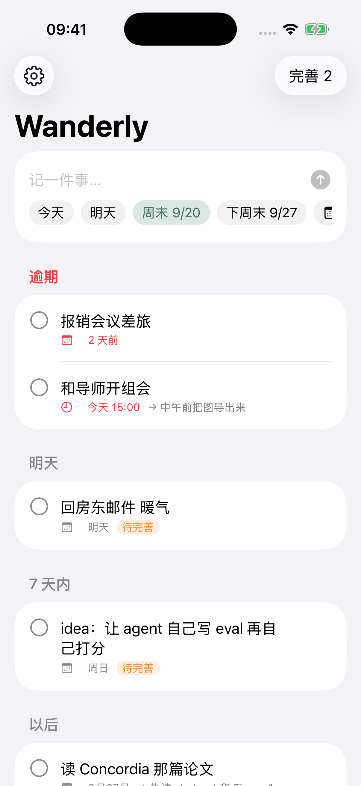

# Wanderly

> Paste it now, let AI sort it out, get reminded before you forget.

Wanderly is a small native app for iPhone and Mac for the irregular things in a day: a meeting, an idea, a link, something important that isn't urgent yet. Paste or type a paragraph and say how urgent it is. AI organizes it in the background and asks what's missing, and Wanderly keeps reminding you until it's refined and done.



## How it works

**Capture.** Paste or type a paragraph and pick how urgent it is: 紧急, 这几天, 不急, or 只记录. A deadline is optional. If the text already says when ("周五下午三点", "明天", "下周一 10:30", "tomorrow 3pm"), Wanderly picks it up. You can also capture from the widgets, the Control Center control, the share sheet in other apps, Siri or Shortcuts, and the Mac menu bar.

**AI organizes in the background.** You don't wait on a screen. For each new note, AI writes a short title, picks a category (待办, 会议, 想法, 资料, 其他), summarizes it, notices a deadline if the text states one, and asks follow-up questions. How deep it goes depends on the category: a to-do or meeting gets at most two practical questions, an idea gets deeper ones. The results are saved in the note and sync through iCloud, so leaving the app or switching devices doesn't lose them.

**Talk it through.** Every note has a conversation with AI that you can keep going on iPhone or Mac. Ideas get a more thoughtful, longer-form partner; everything else stays short. Export a note with its conversation as Markdown from the note's menu.

**Reminders.**
- About two hours after you capture something (never late at night), you're reminded to answer AI's questions while you still remember the context.
- Notes that still aren't refined keep coming back in the evening: 紧急 every day, 这几天 every two days, 不急 every week. 只记录 is never reminded.
- Refined notes without a deadline get a morning "还在进行吗？" on the same cadence.
- Notes with a deadline also get a morning notice on the due day, a notification at the time, and a "做完了吗？" check afterwards.
- When several notes land in the same slot, they're combined into one notification. Notification buttons let you answer, snooze, or mark done.

Reminders are planned two weeks ahead. The iPhone app asks the system to wake it about once a day, the Mac app refreshes every few hours from the menu bar, and if Wanderly hasn't been opened in a long time, a last notification asks you to open it.

**Beta: Idea growth.** Turn it on in Settings.
- *Wander:* about once a week, AI looks at a few of your ideas and suggests how they might connect. It's labeled as speculation; you can adopt it as a new idea or delete it.
- *Water:* when an idea hasn't been touched for a few days, AI asks one new question about it.

**Sync.** Notes and conversations sync between devices through iCloud (a CloudKit private database). There's no server and no account to create. The widgets and the share extension reach the app through an App Group: the app writes a small snapshot for the widgets, and shared notes wait in an inbox until the app next opens.

## Project layout

| Path | What |
| --- | --- |
| `project.yml` | XcodeGen spec: the multiplatform app (iOS 18, macOS 15), its widget and share extensions, and iOS UI tests |
| `Wanderly/` | SwiftUI app: SwiftData models, background AI worker, notifications, background refresh, views, App Intents |
| `WanderlyWidgets/` | Home screen and lock screen widgets, plus the Control Center control |
| `WanderlyShare/` | Share extension for iPhone and Mac |
| `WanderlyCore/` | Swift package with the pure logic: deadline parsing, reminder planning, AI clients and prompts, widget snapshot and inbox, Markdown export |
| `WanderlyUITests/` | Simulator UI tests |

## Build

```sh
brew install xcodegen
scripts/sync-secrets.sh   # optional: bake the Gemini key from ~/.env into local builds
xcodegen generate
open Wanderly.xcodeproj
```

## Test

```sh
# Logic tests. Set GEMINI_API_KEY to also call the live API.
cd WanderlyCore && swift test

# UI tests on the simulator. TEST_RUNNER_WANDERLY_LIVE_AI=1 enables the live AI test.
xcodebuild test -scheme Wanderly -destination 'platform=iOS Simulator,name=iPhone 17'
```

Launch arguments:
- `-demo` uses an in-memory store with sample notes. AI stays off unless you also pass `-demoAI`.
- `-skipNotificationPrompt` doesn't ask for notification permission.
- `-refine` (together with `-demo`) opens the refine view right away.
- `-renderWidgets` (iOS debug builds) writes widget previews as PNGs into the app's `tmp` folder.

## AI

Gemini is the default; you can switch to Claude in Settings.

- **Gemini:** quick tasks use `gemini-flash-latest` with low thinking and fall back to `gemini-flash-lite-latest` when busy or rate-limited. Conversations about ideas, watering, and wandering use `gemini-pro-latest` and fall back to `gemini-flash-latest`.
- **Claude:** `claude-opus-5`, low effort for quick tasks and medium for ideas, with structured JSON output and server-side refusal fallback.

A key typed into Settings is stored in the Keychain and syncs to your other devices through iCloud Keychain. For your own builds you can also bake in a Gemini key: `scripts/sync-secrets.sh` reads `GEMINI_FREE_API` from `~/.env` and writes it to `Config/Secrets.xcconfig`, which git ignores. The key then sits inside the app bundle, so don't do this for builds you give to other people.

The prompts are in `WanderlyCore/Sources/WanderlyCore/Organizer.swift`, `Conversation.swift`, and `Wanderer.swift`.

## History

The earlier web prototype (idea garden, wandering fragments, Dreaming) is still in the git history before the native rewrite.

## License

MIT. See [LICENSE](LICENSE).
